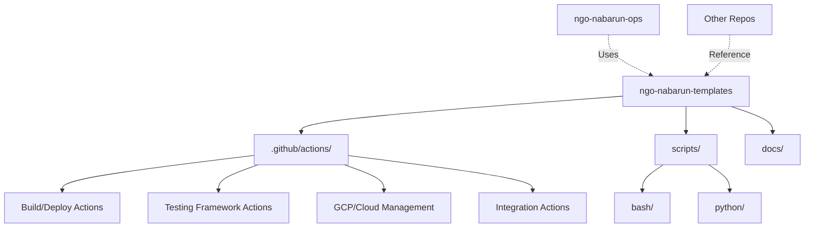

# 🛠️ NGO Nabarun Templates Repository

A centralized repository for **reusable automation assets**, including GitHub Actions, Bash scripts, and Python utilities designed to streamline CI/CD, testing, and operations for NGO Nabarun projects.

---

## 🏗️ Repository Architecture

This repository follows a modular structure to provide maximum reusability across the NGO Nabarun ecosystem:

---

## 🧩 Key Components

### ⚡ GitHub Actions (`.github/actions/`)
The core of our automation, providing plug-and-play functionality for workflows:

| Category | Key Actions |
| :--- | :--- |
| **🚀 Build/Deploy** | `build-java`, `build-node`, `prepare-node-artifact`, `resolve-inputs` |
| **🧪 Testing** | `cucumber-discover-scenarios`, `cucumber-run-tests`, `test-setup`, `test-results-consolidation` |
| **☁️ GCP Ops** | `gcp-clean-gae-versions`, `gcp-promote-gae-traffic`, `gcp-restart-app-engine`, `gcp-download-logs` |
| **📊 Integration** | `qmetry-upload-manager`, `qmetry-result-linker`, `notify-system` |
| **🛠️ Utilities** | `update-json-from-env`, `update-pr-description`, `validate-and-find-file` |

### 📜 Automation Scripts (`scripts/`)
Native scripts for low-level automation and complex logic:

- **Bash (`scripts/`)**:
  - `discover_scenarios.sh`: Dynamic Cucumber scenario discovery.
  - `run_cucumber_tests.sh`: Robust test execution with rerun logic.
  - `wait-for-qmetry-report-import.sh`: API polling for test management.
- **Python (`scripts/common/`, `scripts/auth0/`)**:
  - `set_env.py`: Intelligent environment variable management.
  - `process_auth0_v2.py`: Advanced Auth0 configuration transformation.

---

## 📖 Essential Documentation

For detailed usage instructions, refer to these comprehensive guides:

- 📘 **[Comprehensive Usage Guide](COMPREHENSIVE-USAGE-GUIDE.md)**: The ultimate reference for all templates.
- 🔄 **[Workflow Transformation](WORKFLOW-TRANSFORMATION.md)**: Guide on how workflows are structured and transformed.
- 📑 **[Script Documentation](docs/scripts.md)**: Technical details for Bash automation.
- 🐍 **[Python Reference](docs/python_scripts.md)**: Documentation for Python-based utilities.

---

## 🔄 Dynamic Usage in NGO Nabarun

This repository is primarily utilized by the **[ngo-nabarun-ops](https://github.com/nabarun-ngo/ngo-nabarun-ops)** repository to orchestrate:

1. **Deployment Pipelines**: Using `build-*` and `gcp-*` actions.
2. **Automated Testing**: Using `cucumber-*` and `test-*` actions.
3. **Environment Sync**: Using `auth0/` scripts and `update-json-from-env`.

---

## 🤝 Contributing

1. **Identify** a reusable pattern in any of our workflows.
2. **Abstract** the logic into a new GitHub Action or script.
3. **Document** the usage in the relevant section.
4. **Submit** a PR for review.

---

## 📄 License

This project is licensed under the MIT License - see the [LICENSE](LICENSE) file for details.

---

  Built with ❤️ by the NGO Nabarun DevOps Team

